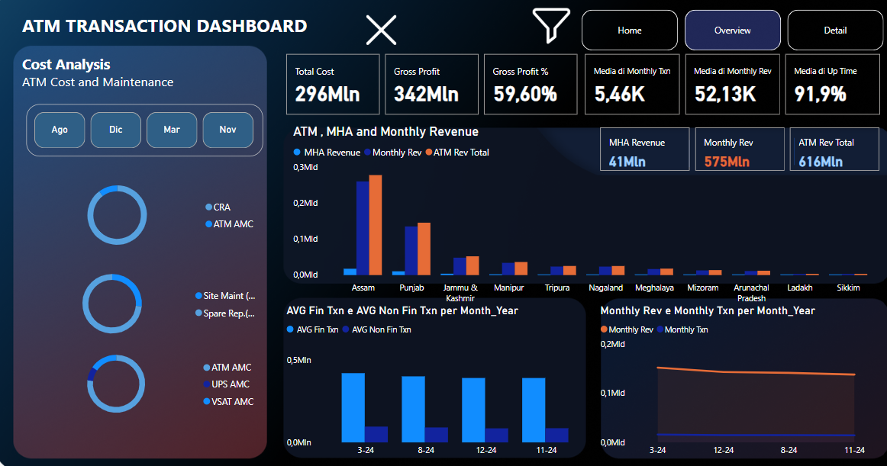
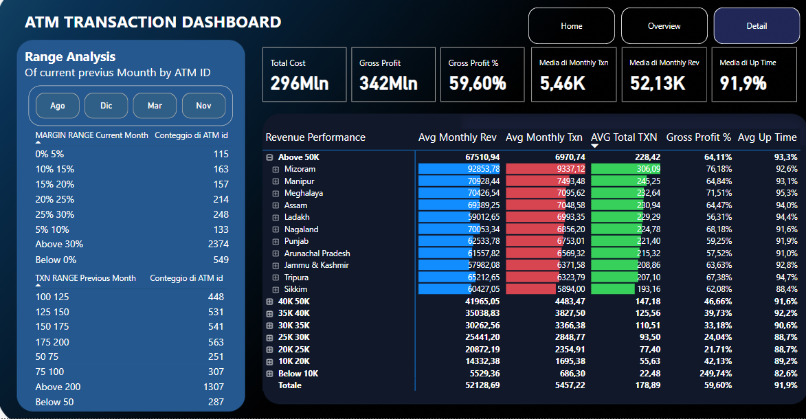
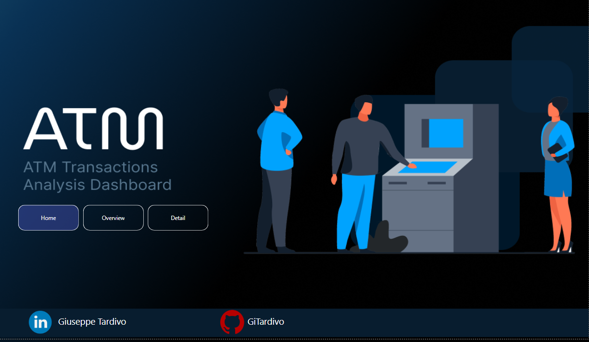

# ATM Transactions Analysis Dashboard

## Descrizione

Questa dashboard analizza le transazioni degli sportelli automatici (ATM) in termini di costi, manutenzione, ricavi e prestazioni. È stata progettata per supportare i decisori aziendali nel monitoraggio e nell'ottimizzazione delle operazioni ATM.

La dashboard si articola in tre sezioni principali:

- **Home**: Introduzione e navigazione tra le sezioni.
- **Overview**: Analisi complessiva delle metriche principali, come costi totali, profitto lordo e transazioni medie mensili.
- **Detail**: Analisi dettagliata delle fasce di margine e delle prestazioni degli ATM per località.

---

## Obiettivi del Progetto

- Fornire un quadro chiaro e dettagliato delle prestazioni degli sportelli ATM.
- Identificare le aree di miglioramento nei costi di manutenzione.
- Ottimizzare i ricavi attraverso l'analisi dei margini di profitto e delle transazioni.

---

## Tecnologie Utilizzate

- **Power BI**: Per la creazione e la visualizzazione della dashboard.
- **DAX**: Per calcoli e misure avanzate.
- **Dataset CSV/Excel**: Per l'elaborazione dei dati grezzi.
- **GitHub**: Per condividere il progetto e il portfolio.

---

## Struttura della Dashboard

### Home View

### Overview View

### Detail View

---

## Dataset

La dashboard è stata realizzata utilizzando un dataset che include:

- **Costo di manutenzione degli ATM**: CRA, AMC, UPS, VSAT.
- **Entrate mensili e transazioni finanziarie/non finanziarie per località**: MHA Revenue, Monthly Revenue.
- **Margini di profitto su base regionale**.

### Origine dei Dati
I dati sono stati simulati o ottenuti da fonti pubbliche per rappresentare uno scenario realistico di operazioni ATM.

---

## Metriche Calcolate

Le principali metriche utilizzate nella dashboard includono:

- **Gross Profit %**: Calcolato come `(Gross Profit / Total Revenue) * 100`. (DIVIDE(SUM('Dataser'[ Gross Profit ]),SUM('Dataser'[Monthly Rev]),0))
- **Average Monthly Revenue**: Media delle entrate mensili per località.
- **Average Monthly Transactions**: Media delle transazioni finanziarie e non finanziarie mensili.
- **Short Mounth**: Mese in lettere ed abbreviato con prima lettera M ( UPPER(LEFT(FORMAT(DATE(2024, 'Dataser'[Month], 1), "MMM"), 1)) & LOWER(MID(FORMAT(DATE(2024, 'Dataser'[Month], 1), "MMM"), 2, 2))
---

## Target Audience

Questa dashboard è destinata a:

- **Manager aziendali**: Per monitorare l'andamento finanziario e operativo degli sportelli ATM.
- **Team di manutenzione**: Per identificare rapidamente le aree con alti costi di manutenzione.
- **Stakeholder aziendali**: Interessati a ottimizzare i ricavi e ridurre i costi.

---

## Funzionalità Chiave

- **Interattività Avanzata**: Filtri dinamici per esplorare i dati in base a mese, regione e tipologia di transazione.
- **Navigazione Intuitiva**: Layout con pulsanti per spostarsi tra le sezioni della dashboard.
- **Visualizzazioni Dinamiche**: Grafici e tabelle aggiornati in tempo reale con selezioni dell'utente.
- **Design Accattivante**: Stile moderno per migliorare la leggibilità e l'esperienza dell'utente.

---

## Contatti

Per ulteriori informazioni o domande:

- **LinkedIn**: [Giuseppe Tardivo](https://www.linkedin.com/in/giuseppe-tardivo-8710b3298/)
- **GitHub**: [GiTardivo](https://github.com/GiTardivo)

